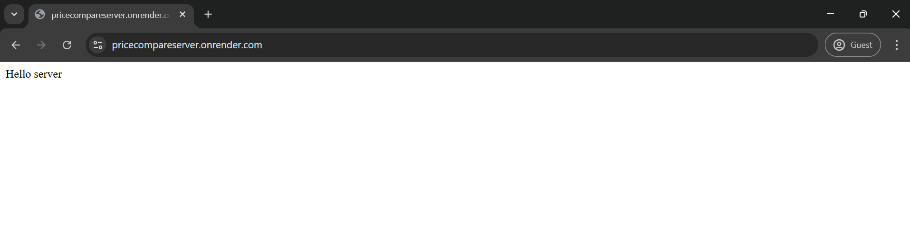
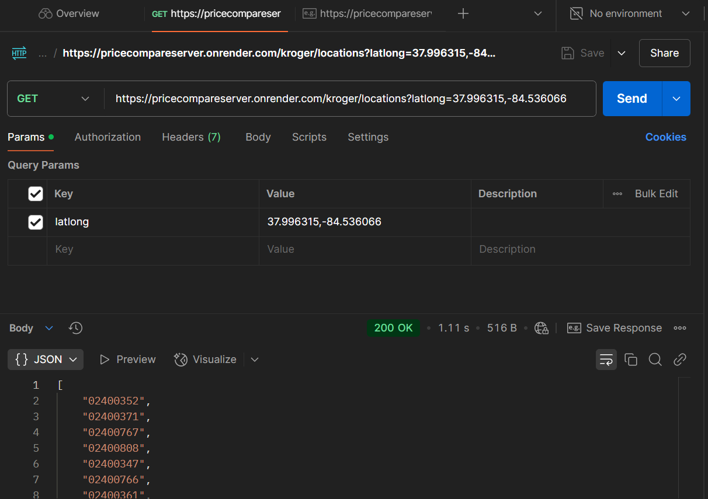
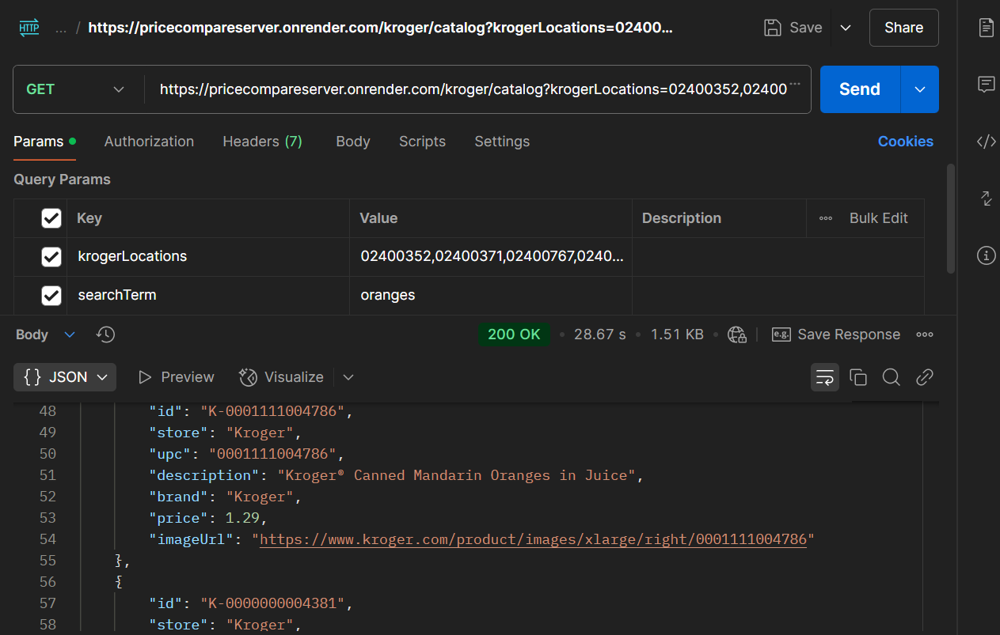
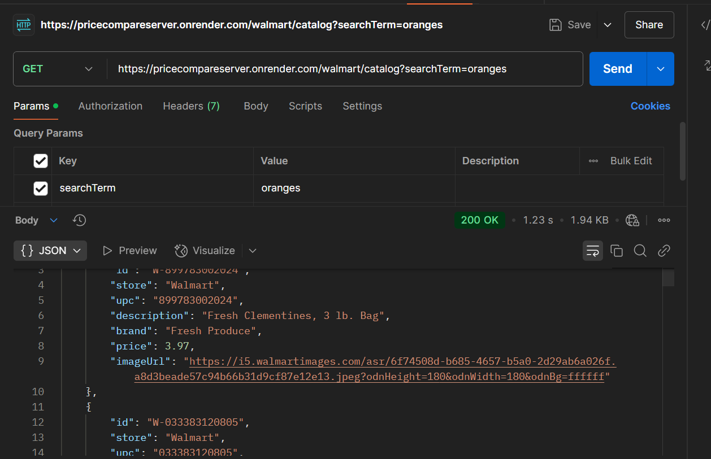

# Supermonkey's Supermarket (Backend Server)

## Project description
This project is the backend component of Supermonkey's Supermarket (see https://github.com/xghouftw/pricecompare). Its sole purpose was to resolve CORS policy issues arising from the needed APIs (Kroger and Walmart).

The project consists two routes handling their respective API calls.

## Detailed workflow

**krogerLocationsController.js**  After authenticating, it is necessary to find all the locations in some radius because the Catalog API requires a store's Id to return price data. If this somehow fails, a default location is provided in the Catalog Controller.

**krogerCatalogController.js** With an input of the search term and comma-separated list of Kroger locations (default one provided if none), this endpoints authenticates and searches through each Kroger location and compiles a listing of products. The method takes the least price for each item across all the locations. It also extracts and formats relevant information (name, brand, price, image). 

**walmartCatalogController.js** This endpoint first generates a signature based on hte timestamp and consumer id for authentication, following Walmart's documentation. Then it calls Walmart's API with the search term and extracts relevant information.

## Demo
You can ping the server at https://pricecompareserver.onrender.com/ to prove it exists.



Shown below are Postman APIs for testing endpoints:

- Kroger Locations


- Kroger Catalog



- Walmart Catalog



## Running the project locally

A Kroger client id & client secret and Walmart consumer id is required to run this project and will not be provided in any `.env` file for privacy reasons.

Clone the repository:
```sh
git clone https://github.com/xghouftw/pricecompareserver
cd comppricebackend
```

Install dependencies:
```sh
npm install
```

Following Walmart's key tutorial (https://walmart.io/key-tutorial), extract the private key into PKCS #8 format and store it at the path `/etc/secrets/walmartPrivateKey`.

Create a `.env` file in the `comppricebackend` directory with the following content:
```sh
KROGER_CLIENT_ID=your-kroger-client-id
KROGER_CLIENT_SECRET=your-kroger-client-secret
WALMART_CONSUMER_ID=your-walmart-consumer-id
WALMART_KEY_VERSION=your-walmart-key-version
```

Start the backend server:
```sh
node server.js
```