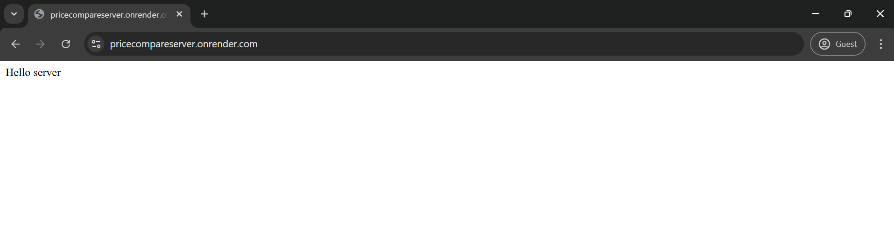

# Supermonkey's Supermarket (Backend Server)

## Project description
This project is the backend component of Supermonkey's Supermarket (see https://github.com/xghouftw/pricecompare). Its sole purpose was to resolve CORS policy issues arising from the needed APIs (Kroger and Walmart).

The project consists two routes handling their respective API calls.

## Demo
You can ping the server at https://pricecompareserver.onrender.com/ to prove it exists.

